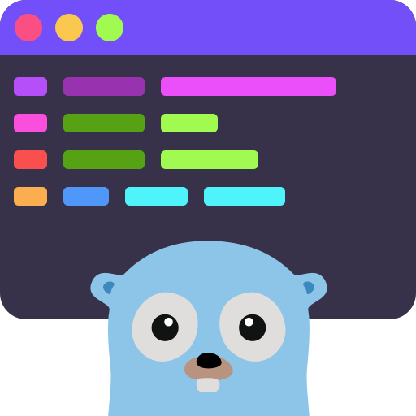

<div align="center">
	<br/>
	<br/>
	
  <h1>
  <code>go-delightful</code>
  <br/>
  <span>command-line messaging with colors and emojis</span>
  </h1>
  <br/>
</div>

Go library designed for command-line applications interacting with humans, providing delightful end-user experience for _informational messaging_ via colourful, lightly structured messages with emojis.

<br/>

✅ &nbsp;**This tool is for _Informational messaging_ for the _end-user_ while the command is running:**

Messages are written into standard error stream (`stderr`) to avoid polluting the actual program output in standard output stream (`stdout`); Hence the messages are intended for end-user communication during the program runtime, not for the actual parseable result output:

> _Not everything on stderr is an error though. For example, you can use `curl` to download a file but the progress output is on stderr. This allows you to redirect the stdout while still seeing the progress._
>
> _In short: `stdout` is for **output**, `stderr` is for **messaging**._
>
> – [12 Factor CLI Apps](https://medium.com/@jdxcode/12-factor-cli-apps-dd3c227a0e46)

<br/>

❌ &nbsp;**This tool is _NOT_ for:**

- _Log Events_ for tracing/debugging the program execution<br/>→ Use logging frameworks such as [zap](https://github.com/uber-go/zap), [zerolog](https://github.com/rs/zerolog) or [logrus](https://github.com/sirupsen/logrus) for more advanced application logging.

- _Command Output_ (i.e. the result) written into `stdout` (which could be redirected to a file for example)<br/>→ Use [`fmt.Print`](https://pkg.go.dev/fmt#Print) for that which defaults to writing into standard output.


<br/>

## Features
- By default prints to Standard Error stream
- Coloured output by default
- Message structure:
  1. `emoji` (optional)
  2. `namespace` (optional)
  3. `...args` (often just a single string)
- Respectful of user environment and disables fancy output if one of below set:
  - `NO_COLOR`
  - `<APP-NAME>_NO_COLOR`
  - `TERM=dumb`

<br/>

For example usage, see [`vegas-credentials`](https://github.com/aripalo/vegas-credentials) which utilizes this library.

<br/>

## Install

```sh
go get github.com/aripalo/go-delightful
```

<br/>

## Usage

```go
package main

import (
  "github.com/aripalo/go-delightful"
)

func main() {

  message := delightful.New("my-app")

  // Print a "banner" showing your app name and other (optional) info.
  // Banner optional info only printed if in verbose mode.
  message.Banner(message.BannerOptionalInfo{
    version: "v0.0.1",
    url:     "example.com",
    extra:   "some extra info, keep it short",
  })

  // Print "title" message in purple.
  message.Title("🔥", "foo", "hello world")

  // Print "debug" message in dark gray.
  // Only printed if in verbose mode.
  message.Debug("⚙️", "foo", "This is only visible if in verbose mode")

  // Print "info" message in gray.
  message.Info("", "foo", "FYI")// passing empty string for emoji disables the emoji prefix

  // Print "prompt" message in cyan.
  // Does not actually read input, only shows the "question".
  message.Prompt("🖌", "foo", "please input maybe:")

  // Print "success" message in green.
  message.Success("💪", "foo", "nicely done")

  // Print "warning" message in yellow.
  message.Warning("⚠️", "bar", "something didn't go as planned, but it might be okay...")

  // Print "failure" message in red.
  message.Failure("❌", "bar", "galaxies exploded")
}
```

